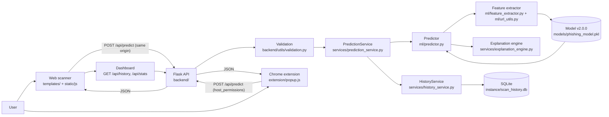

# AI-Powered Real-Time Phishing URL Detection Using Machine Learning and Browser Extension
## Review-2 Technical and Viva Preparation Guide

This guide was built from the repository as of **2026-09-29**.
- **Deployed model:** v2.0.0, 307 automated tests passing.
- **Source of every number:** a file in the repository, cited next to it.
- **Where to check the current value:** if code changes, `models/model_metadata.json` and `docs/testing.md` are the authoritative sources.

Legend used throughout:

| Tag | Meaning |
|---|---|
| **[Implemented]** | Exists in code and is tested |
| **[Measured]** | A number produced by a script in this repository |
| **[Limitation]** | A known weakness |
| **[Future work]** | Not implemented |

---

## Section 1 — Project overview

**Title:** AI-Powered Real-Time Phishing URL Detection Using Machine Learning and
Browser Extension.

**Problem statement.** Phishing websites imitate trusted sites to steal
credentials. Users often cannot judge a link before opening it. We want an
automatic, explainable **risk assessment of a URL** that works from a web page
and from inside the browser.

**Motivation.**
- Blocklists only know already-reported phishing sites; new ones appear
  constantly.
- The team's earlier prototype (`../projectcopy/url`, a notebook plus
  `Phishing_model.pkl`) needed 21 manually prepared features, 15 of which need
  the page's HTML, WHOIS or ranking services. It could not score an arbitrary
  URL automatically (`docs/dataset.md`).

**Objectives.**
1. Extract features **automatically** from a URL string, using the same code
   for training and prediction.
2. Train and evaluate classical ML models with **leakage-controlled** splits and
   honest metrics.
3. Serve predictions through a **Flask REST API** with validation, errors and
   security controls.
4. Store scan **history** in SQLite and show a **dashboard**.
5. Provide a **Chrome Manifest V3 extension** that checks the current tab
   through the same API.
6. Explain every result and state the model's measured limitations.

**Proposed solution (plain words).**
1. You give the system a URL.
2. The server checks it is a valid public http(s) URL.
3. It reduces the URL to the site's *registrable domain* (for example
   `admob.google.com` → `google.com`).
4. It computes 17 numbers describing that domain (length, digits, dots, and so
   on).
5. A trained Gradient Boosting model turns those numbers into a phishing
   probability.
6. The probability is compared with thresholds chosen on validation data, giving
   a low-risk or phishing-risk prediction with an explanation.
7. The result is saved and shown in the web app or the extension popup.

**Scope.**
- In scope: URL-string analysis. The page is never downloaded.
- Out of scope: content analysis, domain age/WHOIS, reputation feeds,
  automatic blocking.

**Users.** Individual users on a local machine (single-user, no login), and the
project team as researchers.

**Expected outcome.**
- A working, tested prototype.
- An honest evaluation of how far URL-only ML goes, including a documented
  false-positive problem and its trade-off.

---

## Section 2 — Research gap

| Limitation of existing approaches | How this project addresses it | Status |
|---|---|---|
| **Traditional URL checking** (blocklists) misses new phishing sites until they are reported | A learned model scores never-seen URLs | [Implemented], with measured recall 0.5675 |
| **Manual feature entry** (our earlier notebook needed 21 prepared features) makes real-time use impossible | `ml/feature_extractor.py` computes all 17 features from the URL string | [Implemented] |
| **URL-only ML is limited:** a URL string lacks page content, domain age and reputation | We measured this: training rows collapse to few distinct feature vectors, with a hard recall ceiling (`docs/ml_error_analysis.md`) | [Measured] limitation |
| **Dataset limitations:** in PhiUSIIL every legitimate URL is a bare homepage | Found and documented; a rule with no ML scores 0.996 F1 on the original split, so reported ~99.9% results are misleading | [Measured] (`docs/model_evaluation.md`) |
| **Real-world false positives:** legitimate subdomains (AdMob, Cloudflare dashboard) flagged | Root cause proven and a registrable-domain model adopted, with its recall cost reported | [Implemented] + [Measured] (`docs/false_positive_investigation.md`) |
| **Need for browser integration** | MV3 extension using the same API | [Implemented] |
| **Need for explainable output** | Feature-based explanations, observations and a disclaimer with measured recall | [Implemented] |

**Existing work vs our contribution.**
- *Existing:* the PhiUSIIL dataset and its stored feature columns; standard
  scikit-learn algorithms; the Public Suffix List; Chrome's extension platform.
- *Ours:*
  1. an automatic extractor that reproduces 17 of the dataset's URL features
     (parity audited in `docs/data/feature_parity.json`);
  2. a leakage-controlled methodology (URL, then host, then registrable-domain
     grouping) that shows how leakage and dataset bias inflate published-style
     metrics;
  3. a root-cause analysis of real-world false positives and a principled,
     non-whitelist fix, with its trade-off measured;
  4. an integrated, tested system: API, database, web UI and extension.

---

## Section 3 — System architecture



What each arrow means:

| Arrow | What happens |
|---|---|
| User → Web scanner / Extension | The user types a URL, or clicks the toolbar icon on the current tab |
| Web scanner → Flask API | `static/js/scanner.js` sends `fetch("/api/predict", {url, source: "web"})`; same origin, so no CORS needed |
| Extension → Flask API | `extension/popup.js` sends the tab URL to `API_BASE + "/api/predict"`, allowed by `host_permissions` |
| API → Validation | JSON shape, field types, length, scheme and internal-host checks (`validate_url`) |
| Validation → PredictionService → Predictor | The service calls `Predictor.predict(url)`; the model was loaded once at start-up |
| Predictor → Feature extractor | `extract_features()` normalises the URL, builds `https://www.<registrable domain>`, computes and validates 17 features |
| Feature extractor → Model → Predictor | `predict_proba` gives P(phishing); thresholds give Safe / Suspicious / Phishing |
| Predictor → Explanation engine | Human-readable reasons derived from the computed features and URL facts |
| PredictionService → HistoryService → SQLite | The scan is saved with secrets redacted; a storage failure never breaks the prediction |
| API → Web / Extension | JSON: prediction, verdict, risk level, confidence, features, explanation, disclaimer, history id |
| Dashboard → API | `GET /api/stats` and `GET /api/history` feed the charts and table |

The layers:

| Layer | What it contains | Directories |
|---|---|---|
| **Frontend** | HTML templates, CSS, three JS files; no framework, no CDN | `templates/`, `static/` |
| **Backend** | Flask app factory, routes, validation, errors, security headers, rate limit, services | `app.py`, `config.py`, `backend/`, `services/` |
| **ML** | Schema, URL utilities, extractor, predictor, training, evaluation, experiments | `ml/`, `models/`, `scripts/` |
| **Data** | PhiUSIIL CSVs (read-only) and the SQLite history | `data/`, `instance/`, `database/` |
| **Browser extension** | MV3 popup that calls the API | `extension/` |

---

## Section 4 — Complete file structure

Generated from the repository and filtered as follows:
- **Excluded:** `.venv/`, `.git/`, caches, `instance/` (runtime database) and
  `results/` (outputs of the original research scripts, 32 MB).
- **Summarised:** `distilbert_model*/` (DistilBERT checkpoints from the original
  research).

```text
phishing_ml_training/
├── app.py                        Flask entry point
├── config.py                     settings from environment variables
├── requirements.txt              pinned scikit-learn 1.6.1, tldextract 5.1.2, Flask, …
├── pytest.ini                    test configuration and markers
├── .env.example                  documented variables (placeholders only)
├── .gitignore                    ignores .venv, .env, instance/, *.pem, *.crx, …
├── README.md
├── backend/
│   ├── __init__.py               create_app(): loads model, database, services, routes
│   ├── routes/                   health.py, prediction.py, model.py, history.py
│   └── utils/                    validation.py, errors.py, security.py, rate_limit.py
├── services/
│   ├── prediction_service.py     wraps the predictor; verdict, summary, disclaimer
│   ├── history_service.py        redaction and history API
│   ├── explanation_engine.py     explanations from computed features
│   └── threat_intelligence.py    optional Safe Browsing lookup (disabled by default)
├── ml/
│   ├── feature_schema.py         the 17 features and their order (single source of truth)
│   ├── url_utils.py              URL validation, normalisation, Public Suffix List
│   ├── feature_extractor.py      URL → model input → 17 features → validation
│   ├── predictor.py              model loading checks, predict(), risk levels
│   ├── dataset.py                loading, dedup, grouped splits, featurisation
│   ├── model_utils.py            model grid, metrics, thresholds
│   ├── train_model.py            training and selection (writes models/)
│   ├── evaluate_model.py         leaky vs leakage-controlled comparison (historical)
│   ├── error_analysis.py         v1.2.0 error analysis (historical)
│   └── view_experiment.py        host vs registrable view experiment
├── database/                     database.py, models.py, repository.py
├── models/
│   ├── phishing_model.pkl, model_metadata.json, tld_legitimate_prob.json   deployed v2.0.0
│   ├── previous_v1.2.0/          archived host-view model
│   ├── baseline_v1.1.0/          archived host-view baseline
│   ├── alternatives/host_view_v1.3.0/   host-view model on the v2 split
│   └── *.joblib, clean/*.joblib  original research-script models (not used by the app)
├── templates/                    base.html, _scanner.html, index.html, inspect.html, dashboard.html
├── static/                       css/style.css, js/main.js, js/scanner.js, js/dashboard.js, img/shield.svg
├── extension/                    manifest.json, config.js, popup.html/.css/.js, icons/, README.md
├── scripts/                      dataset_audit.py, feature_parity_audit.py, feature_comparison.py,
│                                 calibration_report.py, benchmark_api.py, make_icons.py
├── tests/                        9 test modules + browser/ (cdp.py, conftest.py, 3 browser test modules)
├── docs/                         technical docs + docs/data/*.json evidence
├── data/                         PhiUSIIL CSVs (train/validation/test, clean_split/, …)
└── original research scripts     train_models*.py, ensemble*.py, feature_ablation*.py,
                                  analyze_feature_importance.py, train_distilbert*.py, predict.py,
                                  create_clean_split.py
```

Untracked local files that are ignored and not part of the project:
- `extension.pem` — a **private signing key**; never share or commit it.
- `extension.crx`

### Important files explained

| File | Purpose | Technology | What the code does | Used by | A reviewer may ask |
|---|---|---|---|---|---|
| `app.py` | Entry point | Python/Flask | Sets `OMP_NUM_THREADS` from `ML_THREADS`, then `create_app()`; `python app.py` runs the dev server | You / gunicorn | "How does a request reach the model?" |
| `config.py` | Configuration | Python | Reads env vars: port, model paths, DB path, limits, `CLIENT_ORIGIN`, `ALLOW_PRIVATE_HOSTS`, `ML_THREADS` | `backend/__init__.py` | "Where do secrets live?" (only in env vars) |
| `backend/__init__.py` | App factory | Flask | Loads the predictor once, initialises SQLite, wires services, registers blueprints, error handlers, security headers | `app.py`, tests | "Is the model loaded per request?" (no; tested) |
| `backend/routes/prediction.py` | `POST /api/predict` | Flask | Rate limit, validate, predict, map errors to codes, record history | clients | "What happens on a bad URL?" |
| `backend/routes/history.py` | History and stats | Flask | Pagination, filters, get/delete one, clear, stats; validates ids and params | dashboard | "How is SQL injection prevented?" |
| `backend/routes/model.py` | `GET /api/model-info`, `/api/features` | Flask | Real metadata; no file paths | UI | "Are metrics hard-coded?" (no, read from metadata) |
| `backend/routes/health.py` | `GET /api/health` | Flask | Status and whether the model is loaded | UI banner | — |
| `backend/utils/validation.py` | Input validation | Python | JSON/fields/types, length, scheme allow-list, internal-host policy | prediction route | "How do you stop `javascript:`, `file:`, `localhost`?" |
| `backend/utils/errors.py` | Error contract | Flask | `{success: false, error: {code, message}}`, no internals | all routes | "Can stack traces leak?" |
| `backend/utils/security.py` | Headers and CORS | Flask | CSP, nosniff, frame deny, Permissions-Policy, exact-origin CORS | all responses | "What is CORS?" |
| `backend/utils/rate_limit.py` | Rate limit | Python | Sliding window, 60 predictions/min per client | prediction route | "How do you prevent abuse?" |
| `services/prediction_service.py` | Prediction service | Python | Calls `Predictor.predict`; adds verdict wording, summary, disclaimer with measured recall, model version | routes | "Why 'low-risk prediction' instead of 'safe'?" |
| `services/history_service.py` | History service | Python | Redacts URL secrets, builds and stores the record, converts DB errors to 503 | routes | "What do you store?" |
| `services/explanation_engine.py` | Explanations | Python | Compares features with legitimate-training percentiles; URL observations (port, `@`, punycode, subdomain, embedded domain) | predictor | "Are explanations invented?" (no, computed) |
| `services/threat_intelligence.py` | Optional Safe Browsing | Python | Disabled unless an API key is set; never changes the model output | service | "Do you use reputation feeds?" (not by default) |
| `ml/feature_schema.py` | Feature schema | Python | Names, order, types, ranges, descriptions; excluded features and why; input views | everything ML | "Why must the order be fixed?" |
| `ml/url_utils.py` | URL handling | Python, tldextract | `normalize_url` (validation, IDNA), `split_registrable` / `registrable_domain` (PSL), `describe_url` | extractor, API | "What is a registrable domain?" |
| `ml/feature_extractor.py` | Feature extraction | Python | `model_input()` (view), `compute_features()`, `validate_vector()`, `extract_features()` | predictor, dataset | "How do you convert a URL into model input?" |
| `ml/predictor.py` | Predictor | Python, scikit-learn | Checks model/metadata/schema consistency on load; `predict()` extract → probability → risk → explanations | service | "What if the model file is missing?" |
| `ml/dataset.py` | Dataset and splits | pandas, scikit-learn | Dedup, validation, grouped stratified split (registrable domain), featurise | training, tests | "How do you prevent leakage?" |
| `ml/model_utils.py` | Model utilities | scikit-learn | 6 model families × 2 weightings, metrics, FPR-capped threshold | training | "Which models did you compare?" |
| `ml/train_model.py` | Training | Python | Split, TLD table, fit grid, bootstrap selection, threshold, subdomain check, test once, archive, save, metadata | `python -m ml.train_model` | "How was the model selected?" |
| `ml/view_experiment.py` | False-positive experiment | Python | Host vs registrable view on validation | docs | "How did you prove the fix?" |
| `ml/evaluate_model.py` | Leakage study (historical) | Python | Original leaky vs controlled experiments | docs | "Why not report 99.9%?" |
| `ml/error_analysis.py` | Error analysis (v1.2.0) | Python | FN/FP patterns, feature sufficiency, permutation importance | docs | "Why is recall limited?" |
| `database/database.py` | DB connection | sqlite3 | Connections, WAL, schema, v1→v2 migration, wraps errors | repository | "Why SQLite?" |
| `database/models.py` | Schema | SQL | Table, CHECK constraints, indexes, migrations | database | "Show your schema." |
| `database/repository.py` | SQL | sqlite3 | Parameterised add/get/list/delete/clear/stats; LIKE escaping | history service | "How is SQL injection prevented?" |
| `templates/_scanner.html` | Scanner + result card | Jinja/HTML | Form, loading/error/result states, meter, explanations, feature table | index, inspect | — |
| `templates/index.html` / `inspect.html` / `dashboard.html` | Pages | Jinja/HTML | Landing; full analysis and model info; history dashboard | Flask routes | — |
| `static/js/main.js` | Shared client | JavaScript | `api()` with timeout and error mapping; `el()` safe DOM; formatting; health banner | all pages | "How do you prevent XSS?" |
| `static/js/scanner.js` | Scanner logic | JavaScript | Submit, render result, saved-scan view, model section | index, inspect | "How does the browser call Flask?" |
| `static/js/dashboard.js` | Dashboard | JavaScript | Stats cards, HTML bars and SVG chart, table, search, filter, pagination, delete | dashboard | "Are the chart numbers real?" |
| `static/css/style.css` | Styling | CSS | Layout, components, responsive breakpoints | all pages | — |
| `extension/manifest.json` | MV3 manifest | JSON | `activeTab` + API host permission, popup, CSP | Chrome | "What permissions and why?" |
| `extension/config.js` | Extension config | JavaScript | `API_BASE`, request timeout | popup | "How do you change the API URL?" |
| `extension/popup.js` | Popup logic | JavaScript | Read the active tab URL, reject unsupported schemes, call the API, render, buttons | popup.html | "Does it read the page?" (no) |
| `scripts/dataset_audit.py` | Data audit | Python | Duplicates, overlaps for all split methods, original notebook analysis | docs | "How many duplicates?" |
| `scripts/feature_comparison.py` | Feature table | Python | v1.2.0 vs v2.0.0 features and predictions for sample URLs | docs | — |
| `scripts/calibration_report.py` | Calibration | Python | Reliability table, Brier score, ECE | docs | "Is 98% confidence reliable?" |
| `scripts/benchmark_api.py` | Performance | Python | Times the real `python app.py` process | docs | "How fast is it?" |
| `tests/…` | Automated tests | pytest | 307 tests including 56 headless-Chrome tests | CI/you | "How do you know it works?" |

---

## Section 5 — Machine learning: key concepts in our project

1. **What is phishing?** A fraud where an attacker imitates a trusted site to
   steal passwords, card numbers or other data.
2. **A phishing URL** is the address of such a site. Examples from our data:
   `https://fb-restriction-case-dcaf7.firebaseapp.com/`, and the test-suite URL
   `http://paypal-login-secure-verify.account-update.xyz/signin`.
3. **Why URL-based detection?** The URL is available *before* the page is
   opened. It is tiny, private to analyse (no page download) and fast: 0.79 ms
   median inside the server [Measured].
4. **Supervised learning** means learning from labelled examples. PhiUSIIL
   gives 235,795 URLs labelled 0 = phishing and 1 = legitimate.
5. **Classification** means predicting a category. Ours is binary (phishing vs
   legitimate), turned into three risk levels.
6. **A feature** is a number describing the input, e.g. `DomainLength`,
   `NoOfDegitsInURL`. We use 17.
7. **Feature extraction** converts a URL into those 17 numbers, in
   `ml/feature_extractor.py`.
8. **Preprocessing** includes URL normalisation (scheme, lower-casing, IDNA),
   deduplication, rejecting invalid URLs and computing the registrable domain.
   No scaling is needed because tree models ignore feature scale.
9. **Train / validation / test split.** We use 80/10/10:
   - *train* fits the model;
   - *validation* selects the model and threshold;
   - *test* is used **once** for the final number.
10. **Data leakage** means information from test data influencing training or
    selection. Examples we found:
    - the same URL in train and test (63 test rows in the original split);
    - the same host (2,025 rows);
    - sibling subdomains of one domain (3,317 test rows in the v1.2.0 split);
    - a feature that directly encodes the label (`URLSimilarityIndex`).
11. **Overfitting:** the model memorises training data and fails on new data.
    We check validation vs test agreement and use modest tree depth (3).
12. **Underfitting:** the model is too simple to capture patterns. Logistic
    Regression reached only 0.2875 validation recall at 5% FPR, against 0.5675
    for Gradient Boosting [Measured].
13. **Class imbalance:** our data is 42.7% phishing, which is mild. Balanced
    weighting was compared and gave no significant gain (`docs/ml_error_analysis.md`).
14. **Precision** = TP / (TP + FP): of URLs we flag, how many are phishing.
    v2.0.0 test: 0.8801.
15. **Recall** = TP / (TP + FN): of phishing URLs, how many we catch. v2.0.0
    test: **0.5675**.
16. **F1** is the harmonic mean of precision and recall. v2.0.0: 0.6900.
17. **Accuracy** is the share of correct predictions. v2.0.0: 0.7872. It can
    mislead, because it hides which class errors fall on.
18. **Confusion matrix** (v2.0.0 test):
    - TN 12,691 (legitimate passed);
    - FP 744 (legitimate flagged);
    - FN 4,161 (phishing missed);
    - TP 5,459 (phishing caught).
19. **False positive:** a legitimate site flagged as phishing, such as v1.2.0
    flagging `admob.google.com`.
20. **False negative:** a phishing site marked low-risk. v2.0.0 misses 43.3%.
21. **Why phishing recall matters:** a missed phishing URL can lead to stolen
    credentials, while a false alarm costs a moment of doubt. But too many
    false alarms make users ignore warnings, which is why we cap FPR.
22. **Probability / confidence.**
    - `phishing_probability` is the model's `predict_proba` output.
    - "Model confidence" is that probability for the reported side of the
      threshold.
    - Both are **uncalibrated** model scores, not certainty.
23. **Threshold tuning:** choosing the cut-off on the probability. Ours is the
    lowest threshold with validation FPR ≤ 5% (0.5200), chosen on validation
    only.
24. **Probability calibration:** whether "0.8" really means an 80% chance.
    v2.0.0 validation ECE is 0.061; scores of 0.5–0.6 were phishing 83% of the
    time (`docs/data/calibration.json`).
25. **Why a model can say 98% and still be wrong:** the probability reflects
    patterns in the training distribution. v1.2.0 saw that 99% of `.com` hosts
    with a subdomain were phishing, so it gave 0.98 to `admob.google.com`, a URL
    type almost absent from its legitimate training data (distribution shift).
26. **Why legitimate subdomains look suspicious:** in PhiUSIIL only 0.31% of
    legitimate `.com` hosts have a subdomain, against 49.9% of phishing hosts
    (`docs/false_positive_investigation.md`).
27. **Why dataset quality matters:** the model can only learn what the data
    shows. Every legitimate URL being a bare homepage made the "shape" of the
    URL predictive: a rule scores 0.996 F1 on the original split.
28. **Why train/test leakage misleads:** the original random split with the 22
    stored features scores ~0.9997, but that comes from leakage and bias, not
    phishing knowledge (`docs/model_evaluation.md`).

---

## Section 6 — Features

**Model input.** Every feature is computed from the string
`https://www.<registrable domain>` (the **registrable view**). The subdomain,
path, query, port and userinfo are not model inputs. The order below is the
order the model was trained with; it is defined once, in
`ml/feature_schema.py` (`FEATURE_NAMES`).

| # | Feature | Type | Meaning / how extracted | Why useful | Weakness | Example (`admob.google.com` → input `https://www.google.com`) |
|---|---|---|---|---|---|---|
| 1 | `URLLength` | int | Length of the model-input string | Long domains are unusual for legitimate sites | Always `DomainLength + 8` in this view (redundant) | 22 |
| 2 | `DomainLength` | int | Characters in the host part (`www.` included) | Same | Legitimate long names exist | 14 |
| 3 | `IsDomainIP` | int 0/1 | Host is or contains a dotted IPv4 or IP literal | IP hosts are rare for legitimate sites | Almost never 1 in the data (single-feature AUC 0.503 in v1.2.0) | 0 |
| 4 | `CharContinuationRate` | float | (longest letter run + digit run + symbol run) / core length | Mixed random strings are suspicious | Weak alone | 1.0 |
| 5 | `TLDLegitimateProb` | float | Legitimacy prior of the TLD from the training split (`models/tld_legitimate_prob.json`); 0.0 if unseen | Some TLDs host mostly phishing | Derived from the dataset's legitimate list; new TLDs get 0 | 0.5229 (`.com`) |
| 6 | `TLDLength` | int | Length of the last label | Unusual TLDs | Weak | 3 |
| 7 | `NoOfSubDomain` | int | Dots in the host minus one | In this view it separates normal domains (1) from multi-label suffixes and shared hosting such as `x.firebaseapp.com` (2) | `co.uk` also gives 2 | 1 |
| 8 | `NoOfLettersInURL` | int | ASCII letters in the input (scheme and `www.` removed) | Name length/composition | Correlated with `DomainLength` (r ≈ 0.94) | 9 |
| 9 | `LetterRatioInURL` | float | Letters / length (3 decimals) | Composition | — | 0.409 |
| 10 | `NoOfDegitsInURL` | int | Digits | Random or generated names have digits | Legitimate brands can have digits | 0 |
| 11 | `DegitRatioInURL` | float | Digits / length | Same | Correlated with feature 10 | 0.0 |
| 12 | `NoOfEqualsInURL` | int | `=` characters | (In paths/queries) | **Always 0** in this view (no query) | 0 |
| 13 | `NoOfQMarkInURL` | int | `?` characters | Same | **Always 0** | 0 |
| 14 | `NoOfAmpersandInURL` | int | `%` characters. The dataset column is misnamed; it does not count `&` | Encoding tricks | **Always 0** in this view | 0 |
| 15 | `NoOfOtherSpecialCharsInURL` | int | Non-alphanumeric characters other than `= ? %` (dots, hyphens) | Hyphen-stuffed names | — | 1 |
| 16 | `SpacialCharRatioInURL` | float | Special characters / length | Same | — | 0.045 |
| 17 | `IsHTTPS` | int 0/1 | "https" in the input | (Scheme) | **Always 1**: the model input is always https, because the dataset's legitimate URLs are all https and scheme would be a shortcut | 1 |

**Why the exact order matters.** A scikit-learn model receives a row of numbers
and knows features only by *position*. If `DomainLength` were sent where
`TLDLegitimateProb` is expected, predictions would be silently wrong. We
prevent that in three ways:
1. one ordered list (`FEATURE_NAMES`);
2. `validate_vector()` checks count, type and range for every prediction;
3. `Predictor.__init__` checks the model's `feature_names_in_` and the
   metadata's feature list against the schema, and refuses to load otherwise
   (tests in `tests/test_predictor.py`).

**Excluded features** (`EXCLUDED_FEATURES`):
- `URLSimilarityIndex` — label leakage; 100 for every legitimate row.
- `URLCharProb` — needs an external corpus.
- `HasObfuscation`, `NoOfObfuscatedChar`, `ObfuscationRatio` — rule not
  reproducible above 99.9% parity.

---

## Section 7 — Model

| Item | v2.0.0 (deployed) — `models/model_metadata.json` |
|---|---|
| Algorithm | `GradientBoostingClassifier` (scikit-learn 1.6.1) |
| Hyperparameters | `n_estimators=200`, `max_depth=3`, `learning_rate=0.1`, `loss=log_loss`, no class weighting, `random_state=42` |
| Input | 17 features in schema order, registrable view |
| Output | `predict_proba` → P(phishing) (class 1 in training = phishing) |
| Serialisation | joblib (compressed), `models/phishing_model.pkl` (0.08 MB) with metadata and TLD table |
| Inference | `Predictor.predict(url)`; the model is loaded once at start-up; 0.79 ms median server-side [Measured] |
| Decision | P < 0.5200 → **Safe** (Low); 0.5200 ≤ P < 0.6443 → **Suspicious** (Medium); P ≥ 0.6443 → **Phishing** (High) |
| Training data | Registrable-grouped split (seed 42): train 187,523, validation 24,784, test 23,055 |

**How it was chosen** (`ml/train_model.py`, all on validation):
1. Twelve candidates were fitted: Logistic Regression, Decision Tree, Random
   Forest, Gradient Boosting, HistGradientBoosting and a larger
   HistGradientBoosting, each unweighted and class-balanced.
2. They were compared at the same false-alarm rate: each model's own validation
   threshold for FPR ≤ 5%.
3. The incumbent configuration (HistGradientBoosting, balanced) is kept unless
   a challenger's recall gain is significant in a paired bootstrap (1,000
   resamples, 95% CI above 0).
4. Only `GradientBoostingClassifier` (unweighted) passed: +0.1395 recall, CI
   [+0.1317, +0.1482].
5. The subdomain false-positive check passed: 0.95% on legitimate subdomain
   URLs vs 4.99% overall.
6. The test set was then scored once.

Validation results (registrable view, threshold = FPR ≤ 5%; descriptive):

| Model | Weighting | Recall | ROC-AUC |
|---|---|---|---|
| Logistic Regression | none / balanced | 0.2875 / 0.2864 | 0.7459 / 0.7503 |
| Decision Tree | none / balanced | 0.4244 / 0.4263 | 0.8203 / 0.8003 |
| Random Forest | none / balanced | 0.4260 / 0.4235 | 0.7690 / 0.7693 |
| **Gradient Boosting** | **none** / balanced | **0.5675** / 0.4326 | 0.8581 / 0.8544 |
| HistGradientBoosting | none / balanced | 0.4294 / 0.4277 | 0.8451 / 0.8277 |
| HistGradientBoosting (large) | none / balanced | 0.4255 / 0.4255 | 0.8322 / 0.8200 |

**Why not "the best model" in general?** The selection rule is a stated
criterion (recall at a fixed false-alarm rate, with a significance test). It
does not claim Gradient Boosting is best in any other sense.

---

## Section 8 — False-positive / error analysis

**Observed issue.** The previous model v1.2.0 labelled these as
**Phishing / High**:

| URL | P |
|---|---|
| `https://admob.google.com/v2/home` | 0.980 |
| `https://publisher.unity.com/packages` | 0.971 |
| `https://dashboard.render.com/` | 0.976 |
| `https://dash.cloudflare.com/…` | 0.982 |

Examples are from the app's own history database.

**Evidence** (`docs/false_positive_investigation.md`):

1. **Counterfactual.** Only the subdomain was changed:

   | Host | P(phishing) |
   |---|---|
   | `google.com` | 0.295 (Safe) |
   | `admob.google.com` | 0.980 |
   | `example.com` | 0.299 |
   | `a.example.com` | 0.954 |

   Any subdomain flips the result.
2. **Dataset.** Legitimate `.com` hosts with a subdomain: 0.31% (169 of
   55,005). Phishing: 49.9% (17,601 of 35,283). All legitimate URLs are bare
   `https://www.<host>` homepages.
3. **Ruled out:** extractor mismatch, feature order, threshold, class
   imbalance, overfitting, duplicate leakage. v1.2.0 was well calibrated
   in-distribution (ECE 0.035); the cause is **distribution shift from dataset
   construction**.
4. **Leakage found on the way.** The host-grouped split let sibling subdomains
   span splits: 3,317 test rows (14.1%) shared a registrable domain with train.

**Fix and measured trade-off (validation, same split):**

| | Host view | Registrable view |
|---|---|---|
| Recall at FPR ≤ 5% | 0.6475 | 0.4277 (same model family) |
| Legitimate-subdomain FPR | 17.8% | 1.2% |
| Recall, phishing on attacker subdomains | 0.991 | 0.328 |
| Recall, phishing on shared hosting | 0.990 | 0.988 |
| 20 real legitimate URLs flagged | 13 | 0 |

Combining both feature sets reproduced the host-view behaviour (18.5%, 13/20).
**This dataset cannot teach the difference between legitimate and phishing
subdomains.**

**Decision.** A documented validation criterion: a model's FPR on legitimate
subdomain URLs must be ≤ 2× its overall FPR. Host view fails at 3.56×; the
registrable view passes at 0.19×. v2.0.0 was then selected as above.

Final test results (v1.3.0 and v2.0.0 share a split; v1.2.0 used another):

| Model | Split | Recall | Precision | F1 | FPR |
|---|---|---|---|---|---|
| v1.2.0 archived | host-grouped | 0.7363 | 0.9140 | 0.8156 | 0.0516 |
| v1.3.0 host-view alternative | registrable-grouped | 0.6801 | 0.9055 | 0.7768 | 0.0508 |
| **v2.0.0 deployed** | registrable-grouped | **0.5675** | 0.8801 | 0.6900 | 0.0554 |

**Why no whitelist.**
- A list of "safe" domains would be manual prediction overriding. It would hide
  the model's real behaviour, invalidate the evaluation and fail for every
  domain not on the list.
- It would also be exploitable: a phishing page on a compromised whitelisted
  domain would be passed.
- The Public Suffix List is different: it encodes registration structure (who
  controls which part of a name) and treats every domain the same way.

**Remaining limitations.**
- Phishing on subdomains of an attacker-owned domain is judged by that domain
  alone. Recall on this class is 0.328. A rule-based *observation* flags an
  embedded domain name such as `login.paypal.com.evil.xyz` but never changes
  the score.
- Hosting platforms missing from the PSL lose per-site identity. Example:
  `bnqqwuvsqnogdme18.z1.web.core.windows.net` is judged as `windows.net`,
  Safe (0.364).
- Compromised legitimate domains can't be detected from the name.
- The fixed dashboards now score only just below the threshold (0.42–0.48).
  They are low-risk *predictions*, not certainties.

**Real-world impact.** v2.0.0 is more usable for everyday browsing: no
systematic alarms on Google or Cloudflare services. It is also weaker at
catching phishing (43% missed). It is a **risk signal**, not protection.

---

## Section 9 — Flask API

All errors use `{"success": false, "error": {"code": "...", "message": "..."}}`.
No stack traces, file paths or secrets are returned (tested).

| Method | Endpoint | Purpose | Input | Output | Errors |
|---|---|---|---|---|---|
| GET | `/api/health` | Liveness and model status | — | `{"status": "ok", "model_loaded": true}` | — |
| POST | `/api/predict` | Score one URL | JSON `{"url": str, "source"?: "web"/"extension"/"api", "record"?: bool}`; other fields rejected | Prediction result (below) | 400 `INVALID_JSON`, `MISSING_URL`, `INVALID_TYPE`, `INVALID_FIELD`, `UNEXPECTED_FIELD`, `URL_TOO_LONG`, `INVALID_URL`, `UNSUPPORTED_SCHEME`, `UNSUPPORTED_HOST`; 413; 415; 422 `FEATURE_EXTRACTION_FAILED`; 429 `RATE_LIMITED`; 500 `PREDICTION_FAILED`; 503 `MODEL_UNAVAILABLE` |
| GET | `/api/model-info` | Model facts from metadata | — | model, version, features, thresholds, test evaluation, disclaimer | 503 |
| GET | `/api/features` | Feature schema | — | 17 feature specs, excluded features | — |
| GET | `/api/history?page&limit&prediction&q` | Paginated history | query params | `{items, page, limit, total, pages}` | 400 `INVALID_PARAMETER`, 503 `HISTORY_UNAVAILABLE` |
| GET | `/api/history/<id>` | One saved scan | id | `{item: {...features, indicators}}` | 400 `INVALID_ID`, 404 `SCAN_NOT_FOUND`, 503 |
| DELETE | `/api/history/<id>` | Delete one scan | id | `{deleted: 1}` | 400, 404, 503 |
| DELETE | `/api/history` | Clear history | — | `{deleted: n}` | 503 |
| GET | `/api/stats?days=30` | Dashboard counts | days 1–365 | totals by prediction/risk/source, daily counts | 400, 503 |

Page routes (HTML): `/`, `/inspect`, `/dashboard`.

**Example** (real output shape; values from model v2.0.0):

```json
POST /api/predict
{"url": "https://admob.google.com/v2/home"}

200 OK
{
  "success": true,
  "url": "https://admob.google.com/v2/home",
  "prediction": "Safe",
  "risk_level": "Low",
  "verdict": "Low-risk prediction",
  "phishing_probability": 0.421,
  "confidence": 0.579,
  "model_input": "https://www.google.com",
  "features": {"URLLength": 22, "DomainLength": 14, "...": "..."},
  "explanation": ["The model assessed the registrable domain google.com; the subdomain 'admob' is not part of the model input.", "..."],
  "disclaimer": "This is a machine-learning risk signal computed from the site's registrable domain name only; ... detected 56.7% of phishing URLs (missing 43.3%) ...",
  "model_version": "2.0.0",
  "history": {"saved": true, "id": 42}
}
```

The `...` marks omitted fields. The probability values match
`docs/data/feature_comparison.md`.

**Security considerations:**
- rate limit of 60 predictions per minute per client;
- body limit 16 KB and URL limit 2,048 characters;
- scheme allow-list and internal-host policy;
- nothing is ever fetched;
- exact-origin CORS without credentials;
- JSON-only errors;
- security headers.

Full details: `docs/api.md`.

---

## Section 10 — SQLite database

- **Why it exists.** Users can review past scans, and the dashboard shows real
  statistics. It also records which model version produced each result, which
  supports evaluation and viva demonstration.
- **Why SQLite.** It's in the Python standard library, needs no server, and
  keeps one local file. WAL mode lets reads and writes run together.
- **Schema** (`database/models.py`, `PRAGMA user_version = 2`): one table,
  `scan_history`, with no relationships.

  | Column group | Columns |
  |---|---|
  | Key and time | `id` INTEGER PK AUTOINCREMENT; `scanned_at` (UTC ISO-8601) |
  | URLs (redacted) | `url`, `normalized_url`, `host` |
  | Result | `prediction` CHECK Safe/Suspicious/Phishing; `risk_level` CHECK Low/Medium/High; `confidence`; `phishing_probability` |
  | Provenance | `model_version`; `processing_ms`; `source` CHECK web/extension/api |
  | Evidence | `features` (JSON); `indicators` (JSON) |

- **Indexes:** `scanned_at`, `prediction`.
- **CRUD** (`database/repository.py`, all parameterised): `add`, `get`, `list`
  (pagination, filter, escaped LIKE search), `delete`, `clear`, `stats`.
- **Migration:** a v1 table (columns up to `source`) is upgraded in place with
  `ALTER TABLE … ADD COLUMN`, tested in `test_v1_database_is_migrated_in_place`.
  The team's current `instance/scan_history.db` (16 scans) was **created
  directly with schema v2**, not migrated: rows start after v2 existed and all
  new columns are filled. The migration path is verified only by the unit test.
- **Data flow:** predict → `HistoryService.record()` → `redact_url()` (drops
  passwords, query values, fragments) → `ScanRepository.add()` → returns `id`.
  If the database fails, the prediction is still returned with
  `history.saved = false`.

---

## Section 11 — Web application

| Page | Route / template | What it shows |
|---|---|---|
| Home | `/` → `index.html` | Hero, compact scanner, recent scans, how it works, limitations (live metrics from `/api/model-info`) |
| Scanner / inspection | `/inspect` → `inspect.html` | Full result: verdict, prediction, risk, confidence, meter with real thresholds, "Why this result?", all 17 feature values, model information and test metrics, confusion matrix, feature schema. `/inspect?id=N` reopens saved scan N |
| Dashboard | `/dashboard` → `dashboard.html` | Totals, phishing-risk vs low-risk counts, distribution bars, 30-day activity chart, history table with search, filter, pagination, View, Delete, Clear |

**How the frontend talks to the backend.**
- `static/js/main.js` `api()` calls `fetch()` on the same origin, with a 15 s
  timeout.
- It parses JSON and maps every failure to a friendly message: network down,
  timeout, non-JSON, API error object.
- Values are written only with `textContent`, never `innerHTML`.
- The meter uses the model's own phishing score and thresholds; no score is
  invented.

---

## Section 12 — Chrome extension

**Manifest V3** is Chrome's current extension platform. It uses stricter CSP
and service workers instead of background pages.

Our extension (`extension/manifest.json`):
- `manifest_version: 3`;
- `permissions: ["activeTab"]`;
- `host_permissions: ["http://127.0.0.1:5000/*"]`;
- a popup;
- **no background service worker and no content script**.

A service worker isn't needed because nothing runs in the background. That also
means there is no automatic scanning; an earlier version auto-scanned every
page with the broad `tabs` permission and was removed for privacy.

Flow:
1. The user clicks the toolbar icon. Chrome grants **activeTab**: temporary
   access to *this* tab's URL.
2. `popup.js` calls `chrome.tabs.query({active: true, currentWindow: true})`
   and gets `tab.url`.
3. It rejects non-http(s) pages locally (`chrome://`, `about:`, `data:`,
   `file://`, …) and sends nothing.
4. `fetch(API_BASE + "/api/predict", {url, source: "extension", record: true})`
   with an 8 s timeout.
5. Flask → validation → feature extractor (registrable view) → model v2.0.0 →
   JSON.
6. The popup shows verdict, prediction, risk, model confidence, up to 4 reasons
   and the disclaimer, with **View details** (`/inspect?id=N`) and **Open
   dashboard**.
7. The scan is in SQLite with `source = extension`, so it appears on the
   dashboard.

- **Configuration:** `extension/config.js` `API_BASE`, plus the matching
  `host_permissions` line (a test checks they match).
- **Failure handling:**

  | Situation | Popup message |
  |---|---|
  | API down | "Cannot reach the scanner API at …" |
  | Timeout | "…did not respond within 8 seconds" |
  | API error | The API's message |
  | Non-JSON response | "unexpected response (HTTP n)" |

Verified behaviour (tests and acceptance):

| Case | Result |
|---|---|
| HTTPS page | Scanned; identical to the web app |
| HTTP page | Scanned |
| `chrome://`, `about:`, `data:` | Chrome doesn't reveal the URL; popup says it cannot be scanned; nothing sent |
| `file://` | "local files"; nothing sent |
| Malformed host (`-bad-.example`) | API `INVALID_URL` message |
| `localhost` | API `UNSUPPORTED_HOST` message |
| Long URLs | Validated by the API (2,048-character limit) |

The extension has no model of its own and blocks nothing.

---

## Section 13 — Security

| Threat | Protection | Implementation | Test |
|---|---|---|---|
| XSS via a scanned URL | DOM text only, no `innerHTML`; URLs never used as links | `static/js/*.js`, `extension/popup.js` | `test_scanned_url_cannot_inject_markup_or_script`, `test_popup_rendering_and_safe_dom`, `test_no_unsafe_dom_apis_in_client_code` |
| HTML/JS injection | Jinja autoescaping; strict CSP; no inline scripts | `templates/`, `backend/utils/security.py` | `test_query_parameters_are_not_reflected_into_html`, `test_no_inline_scripts_or_handlers_in_templates_and_popup` |
| SQL injection | Parameterised queries; escaped LIKE; integer ids | `database/repository.py`, `backend/routes/history.py` | `test_sql_injection_in_search_is_inert`, `test_sql_injection_in_url_and_id_is_inert` |
| Command injection | No shell or subprocess calls on user input in the application | (by design) | Code review only (no dedicated test) |
| SSRF | **The server never fetches or resolves a submitted URL**; features come from the string | `ml/`, `services/` | `test_scanning_never_opens_network_connections` (sockets blocked) |
| Malicious / unsupported URLs | Scheme allow-list; IDNA validation; internal-host policy (19 forms) | `ml/url_utils.py`, `backend/utils/validation.py` | `test_unsupported_scheme`, `test_internal_targets_rejected_by_default` |
| Oversized requests | 16 KB body (413); 2,048-character URL (400) | `config.py`, `validation.py` | `test_oversized_body_rejected`, `test_extremely_long_url` |
| Cross-origin abuse | No CORS by default; exact `CLIENT_ORIGIN` only; `*` refused; no credentials | `backend/utils/security.py` | 4 CORS tests in `tests/test_security.py` |
| API abuse | 60 predictions/min per client → 429 | `backend/utils/rate_limit.py` | `test_rate_limit_returns_429_with_retry_after`, `test_12_rate_limit_on_live_server` |
| Information leakage | JSON errors, no traces; `Server: phishing-detector`; debug off | `backend/utils/errors.py` | `test_errors_never_reveal_internals`, `test_hardening_headers_and_no_version_disclosure` |
| Secret exposure | Secrets only in env vars; URL secrets redacted before storage | `config.py`, `services/history_service.py` | `test_secrets_never_returned`, `test_secrets_in_scanned_url_never_reach_the_database` |
| Local file exposure | Only Flask static serving; traversal refused | Flask | `test_path_traversal_is_refused` (7 encodings) |
| Unsafe extension permissions | `activeTab` + API origin only | `extension/manifest.json` | `test_manifest_is_mv3_with_minimal_permissions` |

**SSRF explained.** Server-Side Request Forgery is when an attacker makes *our
server* request a URL of their choice. For example, cloud metadata at
`169.254.169.254` or an internal admin page could leak data to them. A phishing
scanner that downloaded pages would be exactly such a proxy. Our design avoids
this completely: the URL is treated as text. If page fetching is ever added, it
would need DNS-resolution checks against private ranges, redirect limits,
timeouts, size limits and an isolated network.

**Not implemented:** authentication, dependency vulnerability audit, and
rate-limit sharing across processes.

---

## Section 14 — Testing

**Strategy.** Test each layer in isolation, then drive the real system end to
end in a real browser.
- **Unit:** ML schema, extractor, URL utilities, thresholds, repository.
- **Integration:** Flask test client with the real model and a temporary
  SQLite.
- **Browser:** headless Chrome 153 over the DevTools protocol against live
  servers. The extension is loaded with `Extensions.loadUnpacked`, and the
  toolbar click is simulated with `Extensions.triggerAction`, which grants the
  real `activeTab`.
- **Security:** attack payloads for each item in Section 13.
- **Manual acceptance:** 15 steps against the real `python app.py` and real
  internet pages (`docs/testing.md`).

**Result.** **307 tests: 307 passed, 0 failed, 0 skipped.** A normal run shows
0 warnings; `-W default` shows 5 (LibreSSL notice, test-helper resource
warnings).

| Module | Tests |
|---|---|
| `test_security.py` | 58 |
| `test_api.py` | 49 |
| `test_pipeline.py` | 44 |
| `test_database.py` | 38 |
| `test_features.py` | 24 |
| `test_urls.py` | 13 |
| `test_predictor.py` | 12 |
| `test_model_selection.py` | 7 |
| `test_client_code.py` | 6 |
| `browser/test_frontend_browser.py` | 21 |
| `browser/test_e2e.py` | 21 |
| `browser/test_extension_browser.py` | 14 |

### Test matrix (all rows verified by the tests named; all PASS in the latest run)

| ID | Feature | Input | Expected | Actual | Status | Evidence |
|---|---|---|---|---|---|---|
| TC-01 | Valid safe URL | `https://www.wikipedia.org` | 200, Safe, Low | Safe, Low (web + extension, 91.1%) | PASS | `test_api.py::test_predict_valid_url`; acceptance steps 5, 11 |
| TC-02 | Known phishing URL | `https://jhjhgfg-3176c.firebaseapp.com/` (dataset phishing) | Phishing | Phishing, P 0.995 | PASS | `test_pipeline.py::test_shared_hosting_sites_keep_their_own_identity`, `test_api.py::test_prediction_matches_direct_pipeline` |
| TC-03 | Suspicious URL | `http://paypal-login-secure-verify.account-update.xyz/signin` | Phishing-risk | Phishing, P 0.898 | PASS | `test_api.py::test_suspicious_url`, `test_extension_browser.py::test_suspicious_http_page` |
| TC-04 | Malformed URL | `https://exa mple.com`, `http://-bad-.com/` | 400 `INVALID_URL` | 400 `INVALID_URL` | PASS | `test_api.py::test_malformed_url` |
| TC-05 | Missing URL | `{}` | 400 `MISSING_URL` | as expected | PASS | `test_api.py::test_missing_url` |
| TC-06 | Empty URL | `""`, `"   "` | 400 `MISSING_URL`; UI sends no request | as expected | PASS | `test_api.py::test_empty_url`, `test_frontend_browser.py::test_empty_input_is_rejected_without_a_request` |
| TC-07 | Unsupported scheme | `javascript:`, `file:`, `data:`, `ftp:`; `chrome://` tab | 400 `UNSUPPORTED_SCHEME`; extension sends nothing | as expected | PASS | `test_api.py::test_unsupported_scheme`, `test_extension_browser.py::test_unsupported_schemes_are_not_sent` |
| TC-08 | Very long URL | 3,000–5,000 characters; 20 KB body | 400 `URL_TOO_LONG`; 413 | as expected | PASS | `test_api.py::test_extremely_long_url`, `test_e2e.py::test_5_10_11_…`, `test_6_malformed_requests` |
| TC-09 | Duplicate scan | Same URL twice; triple submit | Two separate rows; UI triple-submit gives one row | as expected | PASS | `test_database.py::test_duplicate_and_long_urls`, `test_frontend_browser.py::test_duplicate_submissions_are_ignored` |
| TC-10 | History retrieval | `GET /api/history`, `/api/history/<id>` | Paginated list; full record | as expected | PASS | `test_database.py::test_predict_is_recorded_and_retrievable`, `test_history_list_shape_and_pagination` |
| TC-11 | History deletion | Delete one / clear | Removed; 404 afterwards | as expected | PASS | `test_database.py::test_delete_one_and_clear`, `test_frontend_browser.py::test_dashboard_delete_and_clear` |
| TC-12 | Dashboard statistics | 3 scans | Cards and charts equal `/api/stats` | as expected | PASS | `test_frontend_browser.py::test_dashboard_statistics_and_table_match_api` |
| TC-13 | Extension scan | Real toolbar click on an HTTPS page | Same result as the web app; `source = extension` | as expected | PASS | `test_extension_browser.py::test_https_page_matches_web_app_prediction`, `test_e2e.py::test_2_…`; acceptance 11–13 |
| TC-14 | API unavailable | Server stopped | Friendly error, banner | "Service unavailable" / "Cannot reach the scanner API" | PASS | `test_e2e.py::test_7_api_down`, `test_extension_browser.py::test_api_unavailable`; acceptance 15 |
| TC-15 | Invalid JSON | `{broken`, array body, bad UTF-8 | 400 `INVALID_JSON` | as expected | PASS | `test_api.py::test_malformed_json`, `test_invalid_utf8_body`, `test_json_array_body` |
| TC-16 | XSS payload | `https://example.com/"><svg/onload=…>` | Shown as text, no script | as expected | PASS | `test_frontend_browser.py::test_scanned_url_cannot_inject_markup_or_script` |
| TC-17 | SQL injection | `' OR '1'='1`, `'; DROP TABLE …`, … in q/url/id | Inert; table intact | as expected | PASS | `test_security.py::test_sql_injection_*` |
| TC-18 | CORS | Listed vs unlisted origin, `*` | Only the exact listed origin granted; no credentials | as expected | PASS | `test_security.py::test_cors_*`, `test_client_origin_setting_and_wildcard_refused` |
| TC-19 | Model loading | Normal start; missing model file | Loaded once; missing → 503 and health `false` | as expected | PASS | `test_api.py::test_model_is_loaded_once_at_startup_not_per_request`, `test_model_not_loaded_returns_503`, `test_e2e.py::test_9_model_loading_failure` |
| TC-20 | Health endpoint | `GET /api/health` | `{"status": "ok", "model_loaded": true}` | as expected | PASS | `test_api.py::test_health`; acceptance step 1 |

---

## Section 15 — Performance

Measured by `python scripts/benchmark_api.py` against the real `python app.py`
process (200 held-out URLs, macOS arm64); raw data in
`docs/data/performance.json`.

| Measure (model v2.0.0) | Value |
|---|---|
| Server-side feature extraction + inference, median | 0.79 ms |
| `POST /api/predict` with history write, client median / p95 | 4.17 / 5.16 ms |
| `POST /api/predict` without history write, median | 1.81 ms |
| 8 concurrent clients | mean 8.65 ms, throughput 862.1 req/s |
| Model loading (start-up until `/api/health` reports the model) | 878 ms, once |
| Database reads: `/api/history` page, `/api/stats` (median) | 1.19 ms, 1.47 ms |

- **Extension response:** end-to-end popup timing was **not formally measured**.
  The popup's API call takes the times above; Chrome UI overhead was not
  measured.
- **Test-suite runtime:** 68 s for 307 tests.
- **Earlier optimisation (v1.2.0, HistGradientBoosting):** limiting OpenMP
  threads (`ML_THREADS=1`) raised concurrent throughput from 41.8 to 426.7
  req/s. v2.0.0's algorithm doesn't use OpenMP when predicting.

---

## Section 16 — Current results (v2.0.0, held-out test, evaluated once)

| Accuracy | Precision | **Phishing recall** | F1 | ROC-AUC | FPR |
|---|---|---|---|---|---|
| 0.7872 | 0.8801 | **0.5675** | 0.6900 | 0.8524 | 0.0554 |

| | Predicted legitimate | Predicted phishing |
|---|---|---|
| Legitimate (13,435) | 12,691 (TN) | **744 (FP)** |
| Phishing (9,620) | **4,161 (FN)** | 5,459 (TP) |

**Dataset** (PhiUSIIL; `docs/data/dataset_audit.json`):

| Item | Value |
|---|---|
| Rows | 235,795 (100,945 phishing / 134,850 legitimate) |
| Duplicate URL rows removed | 425 |
| Invalid URLs rejected | 8 |
| Rows used | 235,362 (42.7% phishing) |
| Registrable-domain groups | 196,046 |

**Splits** (grouped by registrable domain, seed 42; zero overlap at URL, host and
registrable level):

| Split | Rows | Phishing | Legitimate |
|---|---|---|---|
| Train | 187,523 | 79,617 | 107,906 |
| Validation | 24,784 | 11,275 | 13,509 |
| Test | 23,055 | 9,620 | 13,435 |

**What the numbers mean.**
- Of 100 phishing URLs, the model catches about 57 and misses about 43.
- Of 100 legitimate URLs, it wrongly flags about 5.5.
- When it flags a URL, about 88% of flags are phishing, but only at this test
  set's 42% phishing share. In real browsing, where phishing is rare, precision
  would be much lower.
- The earlier ~99.97% figure came from a leaky experiment and must not be
  quoted as a result.

---

## Section 17 — Limitations

1. **Dataset diversity.** Legitimate URLs are popular sites' homepages; almost
   no legitimate subdomains, paths or http URLs.
2. **False negatives.** 43.3% of test phishing is missed. This covers attacker
   subdomains, ordinary-looking or compromised domains, and platforms missing
   from the PSL (e.g. `*.web.core.windows.net`).
3. **False positives.** 5.5% of test legitimate URLs are flagged. Small
   legitimate sites with digits, hyphens or rare TLDs are affected most.
4. **URL-only information.** No page content, certificate, domain age, DNS or
   reputation data.
5. **No guaranteed detection.** The output is a risk signal.
6. **No external reputation database by default.** Optional Google Safe
   Browsing support exists in code, but it's disabled and wasn't used in any
   evaluation.
7. **Changing phishing tactics / model drift.** The model is static; there is
   no retraining pipeline in production.
8. **Uncalibrated probability.** Validation ECE is 0.061; "confidence" is not
   certainty.
9. **Browser permissions.** `activeTab` means scanning only on click; there is
   no real-time or automatic protection and no blocking.
10. **Local deployment.** The Flask development server, no authentication, and
    a per-process rate limit. On macOS, port 5000 conflicts with AirPlay
    Receiver.

---

## Section 18 — Future work (not implemented)

- A **larger and more representative legitimate class**: legitimate
  subdomains, deep links and http URLs. This is the real fix for the subdomain
  trade-off.
- **Threat intelligence / reputation APIs** evaluated as a separate signal.
  Safe Browsing code exists but wasn't evaluated.
- **Domain age / WHOIS, DNS records, TLS certificate analysis** (would require
  safe network access and SSRF protections).
- **HTML/content and screenshot/visual analysis** (requires safely fetching
  pages).
- **Deep learning comparison** on the leakage-controlled split. The original
  DistilBERT scripts used the old leaky setup.
- **Probability calibration** on a separate calibration split.
- **Online model updates / drift monitoring.**
- **Centralised deployment:** WSGI server, HTTPS, authentication, shared rate
  limiting.
- **Production browser protection:** automatic warnings or blocking, with a
  careful privacy design.

---

## Section 19 — Four-person team division

All four members must be able to explain the whole flow in Section 3 and the
false-positive story in Section 8.

**Member 1 — Machine learning / data**
- **Responsibilities:** dataset and audit, preprocessing, feature extraction,
  training and selection, evaluation, leakage analysis, false-positive
  investigation, metadata.
- **Files:** `ml/*.py`, `models/`, `scripts/dataset_audit.py`,
  `feature_parity_audit.py`, `feature_comparison.py`,
  `calibration_report.py`.
- **Docs:** `docs/dataset.md`, `model_evaluation.md`, `ml_error_analysis.md`,
  `false_positive_investigation.md`.
- **Must understand:** supervised learning, classification, feature
  engineering, splits, leakage, overfitting, precision, recall, F1, confusion
  matrix, imbalance, threshold, probability and calibration, the PSL.
- **Must be able to state:** v2.0.0 metrics, why recall fell, why no
  whitelist.

**Member 2 — Backend / API / database**
- **Responsibilities:** Flask app, REST API, validation, prediction service,
  SQLite, history, migrations, errors, CORS, rate limiting, headers.
- **Files:** `app.py`, `config.py`, `backend/**`, `services/*.py`,
  `database/*.py`.
- **Docs:** `docs/api.md`, `docs/database.md`.
- **Must understand:** HTTP, GET/POST/DELETE, JSON, REST, Flask request
  lifecycle, validation, CRUD, SQL injection, CORS, status codes, model loading
  at start-up.

**Member 3 — Frontend / UI / dashboard**
- **Responsibilities:** templates, CSS, scanner, result display, dashboard,
  history table, filtering and search, error states, responsiveness.
- **Files:** `templates/*.html`, `static/css/style.css`,
  `static/js/main.js`, `scanner.js`, `dashboard.js`.
- **Docs:** `docs/frontend.md`.
- **Must understand:** DOM, `fetch`, JSON, async/await, same-origin calls,
  error handling, XSS and `textContent`, CSP, responsive CSS, honest risk
  visualisation.

**Member 4 — Chrome extension / integration / security**
- **Responsibilities:** MV3 manifest, popup, current-tab URL, API integration,
  configuration, permissions, browser tests, security tests, end-to-end
  integration.
- **Files:** `extension/*`, `tests/browser/*`, `tests/test_security.py`,
  `tests/test_client_code.py`.
- **Docs:** `docs/extension.md`, `docs/security.md`, `docs/testing.md`.
- **Must understand:** extension architecture, MV3, service workers (and why we
  have none), permissions and `activeTab`, `host_permissions` vs CORS, CSP, URL
  schemes, SSRF, XSS, SQL injection.

---

## Section 20 — Individual contribution table

| Member | Module | Main files | Responsibilities | Technical knowledge | Demo responsibility | Likely reviewer questions |
|---|---|---|---|---|---|---|
| 1 | ML / data | `ml/feature_schema.py`, `ml/url_utils.py`, `ml/feature_extractor.py`, `ml/dataset.py`, `ml/train_model.py`, `ml/view_experiment.py`, `models/model_metadata.json` | Features, splits, training, evaluation, false-positive analysis | Metrics, leakage, PSL, calibration | Demo steps 1, 6, 15, 16 | "Why is recall 0.57?", "How did you prevent leakage?", "Why no whitelist?" |
| 2 | Backend / DB | `backend/__init__.py`, `backend/routes/*.py`, `backend/utils/validation.py`, `services/prediction_service.py`, `services/history_service.py`, `database/*.py` | API, validation, errors, history, migration | HTTP, REST, SQL, CORS | Demo steps 3, 8 | "What happens on invalid input?", "How is SQL injection prevented?", "Why SQLite?" |
| 3 | Frontend | `templates/*.html`, `static/js/*.js`, `static/css/style.css` | Scanner, dashboard, history UI | DOM, fetch, XSS, CSS | Demo steps 4, 5, 7, 9, 13 | "How does the page call Flask?", "How do you prevent XSS?", "Are charts real?" |
| 4 | Extension / security / testing | `extension/*`, `tests/browser/*.py`, `tests/test_security.py` | MV3, permissions, integration, security tests | Chrome APIs, SSRF, CSP | Demo steps 10–14, 17 | "What permissions?", "Does it read the page?", "How did you test the extension?" |

---

## Section 21 — Reviewer / viva questions (86)

Format: **Q** question · **A** answer · *Why* justification · `file`.

### A. General project
1. **Q:** What does the project do in one sentence? **A:** It assesses a URL's phishing risk with a URL-only ML model, served by a Flask API to a web app and a Chrome extension, with history and explanations. *Why:* that is the implemented flow. `docs/architecture.md`
2. **Q:** Who are the users? **A:** An individual user on a local machine; no accounts. *Why:* there is no authentication. `docs/security.md`
3. **Q:** What is "real-time" here? **A:** A prediction on demand in about 4 ms end to end on the server path. It is not continuous background monitoring. *Why:* measured; the extension scans on click. `docs/testing.md`
4. **Q:** What are the main components? **A:** ML pipeline, Flask API, SQLite history, web UI, MV3 extension. `README.md`
5. **Q:** Does the system visit the website? **A:** No. Only the URL string is analysed. *Why:* no fetching code; a test blocks sockets during scans. `tests/test_security.py`
6. **Q:** What does a user see? **A:** A verdict ("Low-risk prediction" / "Phishing-risk prediction"), prediction, risk level, model confidence, reasons and a disclaimer with measured recall. `services/prediction_service.py`

### B. Machine learning
7. **Q:** What type of learning is used? **A:** Supervised binary classification. `ml/train_model.py`
8. **Q:** What is the positive class? **A:** Phishing (label 0 in the dataset, trained as class 1). `ml/feature_schema.py`
9. **Q:** What does the model output? **A:** P(phishing) from `predict_proba`, mapped by thresholds to Safe / Suspicious / Phishing. `ml/predictor.py`
10. **Q:** Why a threshold of 0.52 and not 0.5? **A:** 0.5200 is the lowest threshold whose validation FPR ≤ 5%, i.e. at most 1 in 20 legitimate URLs flagged. *Why:* a documented policy chosen on validation only. `ml/train_model.py`
11. **Q:** What is "Suspicious"? **A:** P between 0.5200 and 0.6443. 0.6443 is the lowest threshold with 95% validation precision. `models/model_metadata.json`
12. **Q:** Is preprocessing like scaling needed? **A:** No. Tree ensembles are scale-invariant. Normalisation of the *URL* (scheme, case, IDNA) is done. `ml/url_utils.py`

### C. Dataset
13. **Q:** Which dataset? **A:** The PhiUSIIL Phishing URL Dataset, 235,795 rows and 56 columns. `docs/dataset.md`
14. **Q:** Label encoding? **A:** 0 = phishing, 1 = legitimate. `data/dataset_description.csv`
15. **Q:** Class balance? **A:** 42.7% phishing after deduplication; mild imbalance. `models/model_metadata.json`
16. **Q:** Duplicates? **A:** 425 duplicate URL rows (each URL twice, same label), collapsed before splitting. `docs/data/dataset_audit.json`
17. **Q:** Biggest dataset weakness? **A:** Every legitimate URL is a bare `https://www.<host>` homepage, so URL shape predicts the label (a rule scores 0.996 F1 on the original split). `docs/model_evaluation.md`
18. **Q:** Was the original dataset modified? **A:** No. All CSVs are read-only (verified by git); splits are built in memory. `ml/dataset.py`

### D. Feature engineering
19. **Q:** How many features, and which? **A:** 17 lexical features of the registrable domain (Section 6). `ml/feature_schema.py`
20. **Q:** How do you convert a URL into model input? **A:** Normalise → registrable domain via the PSL → `https://www.<domain>` → compute 17 values → validate count/type/range. `ml/feature_extractor.py`
21. **Q:** Why is the order important? **A:** Models read features by position; one ordered list plus load-time and per-prediction checks prevent mismatch. `ml/predictor.py`
22. **Q:** Why not use path and query features? **A:** Legitimate training URLs have no paths, so those features become a shortcut ("any path = phishing"). That was measured in experiment B1: 8/8 legitimate deep links flagged. `docs/model_evaluation.md`
23. **Q:** Which features were excluded, and why? **A:** `URLSimilarityIndex` (label leakage); `URLCharProb` (external corpus); three obfuscation features (not reproducible). `ml/feature_schema.py`
24. **Q:** How do you know your extractor matches the dataset? **A:** A parity audit against all 235,795 rows (`docs/data/feature_parity.json`), and a test that training and prediction features are identical. `scripts/feature_parity_audit.py`

### E. Model
25. **Q:** Which algorithm is deployed? **A:** scikit-learn `GradientBoostingClassifier` (200 trees, depth 3, learning rate 0.1). `models/model_metadata.json`
26. **Q:** How was it selected? **A:** 12 candidates at the same 5% validation FPR; it had the only significant recall gain over the incumbent (+0.1395, CI [+0.1317, +0.1482]). `ml/train_model.py`
27. **Q:** Where is it saved, and how is it loaded? **A:** `models/phishing_model.pkl` via joblib, loaded once in `create_app`. `backend/__init__.py`
28. **Q:** Which version of scikit-learn? **A:** 1.6.1, pinned in `requirements.txt`. `models/model_metadata.json`
29. **Q:** What happened to older models? **A:** Preserved: v1.1.0, v1.2.0 and the v1.3.0 host-view alternative. `models/`
30. **Q:** Why does the model file know its thresholds? **A:** It doesn't; thresholds are in `model_metadata.json`, which the predictor reads. `ml/predictor.py`

### F. Evaluation
31. **Q:** Final metrics? **A:** Accuracy 0.7872, precision 0.8801, recall 0.5675, F1 0.6900, ROC-AUC 0.8524. `models/model_metadata.json`
32. **Q:** Confusion matrix? **A:** TN 12,691 / FP 744 / FN 4,161 / TP 5,459. `models/model_metadata.json`
33. **Q:** How many times was the test set used for v2.0.0? **A:** Once, after the model, threshold and view were chosen on validation. `ml/train_model.py`
34. **Q:** Why is accuracy not your main metric? **A:** It hides error types. Phishing recall and FPR at a fixed operating point matter more. `docs/ml_error_analysis.md`
35. **Q:** What is ROC-AUC 0.85? **A:** The probability that a random phishing URL scores higher than a random legitimate one. `ml/model_utils.py`
36. **Q:** Why did recall drop from 0.7363 (v1.2.0)? **A:** Two reasons: the stricter split removed sibling-subdomain leakage (host view: 0.7363 → 0.6801 on a different test set), and the registrable view gives up the subdomain signal (0.6801 → 0.5675 on the same test set). `docs/false_positive_investigation.md`

### G. False positives
37. **Q:** Why was `admob.google.com` flagged before? **A:** v1.2.0 judged the full host. Any subdomain looked like phishing, because only 0.31% of legitimate `.com` training hosts have one against 49.9% of phishing. `docs/false_positive_investigation.md`
38. **Q:** How did you prove it? **A:** Counterfactual: `google.com` 0.295 vs `admob.google.com` 0.980; `example.com` 0.299 vs `a.example.com` 0.954. `docs/false_positive_investigation.md`
39. **Q:** What was the fix? **A:** Score the registrable domain (PSL eTLD+1) instead of the full host. `ml/feature_extractor.py`
40. **Q:** What did it cost? **A:** Validation recall at 5% FPR fell 0.6475 → 0.4277 for the same model family; attacker-subdomain phishing recall fell 0.991 → 0.328. `docs/data/view_experiment.json`
41. **Q:** Isn't the PSL a whitelist? **A:** No. It lists public suffixes (`com`, `co.uk`, `firebaseapp.com`), not trusted sites; `admob.evil.com` is judged as `evil.com`. `ml/url_utils.py`
42. **Q:** Is `admob.google.com` now confidently safe? **A:** No. P = 0.421, just under 0.52: a low-risk prediction. `docs/data/feature_comparison.md`

### H. Flask / API
43. **Q:** Which endpoints exist? **A:** health, predict, model-info, features, history (list/get/delete/clear) and stats. `backend/routes/`
44. **Q:** What does `/api/predict` accept? **A:** JSON with `url` (required), `source` and `record`; any other field is rejected (400 `UNEXPECTED_FIELD`). `backend/utils/validation.py`
45. **Q:** Can a client send its own feature values? **A:** No. `features` is rejected; features are always computed server-side. `tests/test_api.py::test_manual_feature_values_are_rejected`
46. **Q:** What status codes are used? **A:** 200, 400, 404, 405, 413, 415, 422, 429, 500, 503, each with a stable error code. `backend/utils/errors.py`
47. **Q:** What if prediction fails? **A:** 500 `PREDICTION_FAILED`, with the error logged server-side only. `backend/routes/prediction.py`
48. **Q:** What if the history database fails? **A:** The prediction is still returned (200) with `history.saved = false`; history endpoints return 503. `services/history_service.py`

### I. Database
49. **Q:** Which tables? **A:** One: `scan_history` (schema v2, 14 columns). `database/models.py`
50. **Q:** What is stored? **A:** Redacted URL, host, prediction, risk, confidence, probability, model version, processing time, source, features, indicators, time. `docs/database.md`
51. **Q:** What is never stored? **A:** IP addresses, user agents, headers, cookies, page content. `database/models.py`
52. **Q:** How is it migrated? **A:** `PRAGMA user_version`, with `ALTER TABLE ADD COLUMN` from v1 to v2 (unit-tested). `database/database.py`
53. **Q:** Indexes? **A:** On `scanned_at` and `prediction`. `database/models.py`

### J. Frontend
54. **Q:** How does the page call the backend? **A:** `fetch("/api/predict")` on the same origin with JSON and a 15 s timeout. `static/js/main.js`
55. **Q:** How do you show errors? **A:** Error codes map to field messages or error cards; an offline banner for network or model problems. `static/js/scanner.js`
56. **Q:** How are dashboard charts made? **A:** Distribution bars in HTML/CSS and an activity chart in SVG, built with DOM APIs from `/api/stats`; no library, no fabricated values. `static/js/dashboard.js`
57. **Q:** Is it responsive? **A:** Yes. Browser-tested at 375, 768 and 1280 px for no horizontal overflow. `tests/browser/test_frontend_browser.py`
58. **Q:** Why the wording "Low-risk prediction"? **A:** The model misses 43% of phishing, so "Safe" must not read as a guarantee. `services/prediction_service.py`

### K. Chrome extension
59. **Q:** Which manifest version? **A:** 3. `extension/manifest.json`
60. **Q:** Which permissions? **A:** `activeTab` and host permission for the API origin only. `extension/manifest.json`
61. **Q:** How does it get the URL? **A:** `chrome.tabs.query({active, currentWindow})` after the user clicks; `activeTab` grants the URL. `extension/popup.js`
62. **Q:** Does it have a model? **A:** No. It calls `POST /api/predict`, the same as the web app. `extension/popup.js`
63. **Q:** How is the API URL configured? **A:** `API_BASE` in `extension/config.js`, plus the matching `host_permissions`. `extension/config.js`
64. **Q:** What happens on `chrome://` pages? **A:** Chrome doesn't give the URL; the popup says the page can't be scanned and sends nothing. `tests/browser/test_extension_browser.py`

### L. Security
65. **Q:** How do you prevent XSS? **A:** `textContent` only, no `innerHTML`; strict CSP; tested with payloads. `static/js/main.js`
66. **Q:** How do you prevent SQL injection? **A:** Parameterised queries and integer ids; tested. `database/repository.py`
67. **Q:** How do you prevent SSRF? **A:** The server never requests submitted URLs; a test fails if any socket is opened. `tests/test_security.py`
68. **Q:** Why reject localhost if you never fetch? **A:** The model was trained on public URLs, so scores for internal hosts are meaningless. It's configurable via `ALLOW_PRIVATE_HOSTS`. `backend/utils/validation.py`
69. **Q:** Which security headers? **A:** CSP, nosniff, X-Frame-Options DENY, Referrer-Policy, Permissions-Policy, COOP/CORP, `Server` hiding; HSTS on HTTPS. `backend/utils/security.py`
70. **Q:** Secrets? **A:** Environment variables only; `.env` and `*.pem` ignored; URL secrets redacted before storage. `.gitignore`, `services/history_service.py`

### M. Testing
71. **Q:** How many tests? **A:** 307: 307 passed, 0 failed, 0 skipped. `docs/testing.md`
72. **Q:** How did you test the extension automatically? **A:** Headless Chrome over the DevTools protocol; `Extensions.loadUnpacked` and `Extensions.triggerAction` (a real `activeTab` grant). `tests/browser/cdp.py`
73. **Q:** How do you test failures? **A:** Stopped servers, a broken database path, a missing model, intercepted requests (timeout, 500, non-JSON). `tests/browser/test_e2e.py`
74. **Q:** Did you do manual acceptance testing? **A:** Yes. 15 steps on the real server and real web pages, repeated for v2.0.0. `docs/testing.md`
75. **Q:** Are there ML tests? **A:** Yes: feature parity, schema order, train/predict parity, split reproducibility, the subdomain-invariance property, preserved models load. `tests/test_pipeline.py`

### N. Deployment
76. **Q:** How do you run it? **A:** `python app.py` (Flask development server); `API_PORT=5051` on this Mac. Section 24
77. **Q:** Production readiness? **A:** Not production-ready. It needs a WSGI server, HTTPS, authentication and a shared rate limit. `docs/security.md`
78. **Q:** What if port 5000 is busy? **A:** Use another port and set the same origin in `extension/config.js` and `manifest.json`. `docs/extension.md`
79. **Q:** Is performance adequate? **A:** For a single user, yes: 0.79 ms model time and 862 predictions/s concurrent. `docs/data/performance.json`

### O. Research contribution
80. **Q:** What is your contribution? **A:** An automatic, parity-audited extractor; leakage-controlled evaluation exposing inflated metrics; a root-caused, non-whitelist fix for real-world false positives with a measured trade-off; an integrated, tested system. Section 2
81. **Q:** What is novel? **A:** Not a new algorithm. The contribution is the rigorous methodology and honest trade-off analysis of URL-only ML on PhiUSIIL, packaged into a working, tested system. Section 22
82. **Q:** What did you learn from the leaky experiment? **A:** 99.97% accuracy came from `URLSimilarityIndex` and dataset construction, not phishing knowledge. `docs/model_evaluation.md`

### P. Limitations / future work
83. **Q:** Biggest limitation? **A:** URL-only information plus an unrepresentative legitimate class, giving 43% missed phishing. Section 17
84. **Q:** What would improve recall most? **A:** Representative legitimate subdomain data; then content, domain-age and reputation signals. Section 18
85. **Q:** Is the confidence calibrated? **A:** Not well: validation ECE 0.061. It is presented as model confidence, not certainty. `docs/data/calibration.json`
86. **Q:** Does the extension protect in real time? **A:** No. It checks on click and never blocks. `extension/popup.js`

---

## Section 22 — Hard reviewer questions

1. **Why did you choose this model?**
   - It was the only candidate with a statistically significant recall gain at
     the same 5% validation false-alarm rate, and it passed the
     legitimate-subdomain FPR check.
   - Selection used validation only.
   - We don't claim it's universally best.
2. **Why not deep learning?**
   - Our 17 features are low-dimensional tabular data, where gradient boosting
     is a standard, strong choice.
   - The limiting factor was shown to be *information* (identical feature
     vectors with both labels), not model capacity.
   - The original DistilBERT experiments used the leaky setup; a fair deep
     learning comparison on the leakage-controlled split is future work.
3. **Why not use URL reputation APIs?**
   - The project studies what ML on the URL can do.
   - Reputation lookups send users' URLs to a third party and aren't
     "detection".
   - Optional Safe Browsing code exists, but it's disabled and was not part of
     any evaluation.
4. **How do you prevent data leakage?**
   - Deduplicate URLs, then split grouped by registrable domain, so no URL,
     host or domain spans splits (verified: 0 overlap).
   - TLD prior and explanation percentiles come from train only.
   - Model and thresholds are chosen on validation; test is used once.
   - The leaky `URLSimilarityIndex` is excluded.
5. **How do you know your test result is valid?**
   - The test set was untouched until one evaluation, and grouping prevents
     near-duplicates.
   - Test FPR (5.54%) is close to validation (4.99%).
   - One honest caveat: the host-view alternative and v2.0.0 were both scored
     on this test set, documented as a comparison rather than used for
     selection.
6. **Why can a legitimate URL be classified as phishing?**
   - The model learned dataset patterns.
   - Legitimate training URLs are popular homepages, so small legitimate
     sites, or names with digits, hyphens or rare TLDs, look unusual.
   - 5.5% of test legitimate URLs are flagged.
7. **Why does the model report 98% confidence when wrong?**
   - The probability reflects the training distribution: v1.2.0 saw 99% of
     `.com`+subdomain hosts as phishing, so it said 0.98 for
     `admob.google.com`.
   - A model can be calibrated in-distribution (ECE 0.035) and still wrong
     under distribution shift.
8. **What is a false positive?** A legitimate URL flagged as phishing (744 in
   the test set).
9. **What is a false negative?** A phishing URL predicted low-risk (4,161 in
   the test set).
10. **Which is more dangerous, and why?**
    - For the individual, a false negative: credentials can be stolen.
    - But frequent false positives train users to ignore warnings, so we
      maximise recall under a false-alarm cap rather than ignore false
      positives.
11. **What happens when a new phishing pattern appears?**
    - If its domain looks like training phishing it may be caught; otherwise
      not.
    - The model is static; there is no retraining or drift monitoring (future
      work).
12. **Can attackers evade your model?**
    - Yes. Examples:
      - a normal-looking registered domain;
      - phishing on a subdomain of an innocuous-looking domain they own;
      - a compromised legitimate site;
      - a hosting platform missing from the PSL.
    - All of these are documented.
13. **What happens if the URL is shortened?**
    - The shortener's own domain is scored (e.g. `bit.ly`). We never follow
      the redirect, because that would require fetching.
    - Its score reflects how `bit.ly` appeared in training, not the
      destination.
14. **What happens with IP-based URLs?**
    - A public IP is scored with `IsDomainIP = 1`; `http://45.77.10.3/login.php`
      gives Phishing (0.907).
    - Private or loopback IPs are rejected (400 `UNSUPPORTED_HOST`).
15. **What happens with internationalised domains?**
    - They are converted to punycode (IDNA) during normalisation.
    - An observation notes punycode (`xn--`) look-alike risk. The model scores
      the punycode string.
16. **What happens with URL encoding?**
    - Paths and queries are not model inputs in this view, so encoding tricks
      there don't affect the score.
    - A host with invalid characters is rejected by validation.
17. **Does the extension send the entire webpage to the server?** No, only the
    active tab's URL, only on click.
18. **Does the system download the webpage?** No. There is no code that fetches
    submitted URLs; a test fails if any network connection is opened.
19. **How do you prevent SSRF?** By design, nothing is fetched. Internal hosts
    are also rejected. If fetching were added, it would need private-range
    checks after DNS resolution, redirect limits and timeouts.
20. **How is user input validated?** Server-side, in
    `backend/utils/validation.py` and `ml/url_utils.py`:
    - JSON object with known fields and types;
    - length ≤ 2,048;
    - no whitespace or control characters;
    - http/https only;
    - valid IDNA host;
    - internal-host policy.

    Browser checks are a convenience only.
21. **How is the model loaded?**
    - Once in `create_app`: `Predictor.from_paths()` loads the pickle,
      metadata and TLD table.
    - It checks the feature names and order, and refuses mismatches.
    - A test proves the model is loaded once, not per request.
22. **What happens if the model file is missing?** The app still starts;
    `/api/health` says `model_loaded: false`; predictions return 503
    `MODEL_UNAVAILABLE`; the UI shows a banner (tested).
23. **What happens if the API is unavailable?** The web UI shows "Service
    unavailable" with a banner; the extension says it can't reach the API at
    `API_BASE` (tested).
24. **Why SQLite?**
    - Single-user local app, zero configuration, standard library.
    - The repository layer isolates SQL, so moving to PostgreSQL would only
      change `database/`.
25. **How does the extension communicate with Flask?** `fetch` POST to
    `API_BASE/api/predict`. `host_permissions` for that origin lets the
    extension page call it cross-origin without CORS headers.
26. **Why Manifest V3?** Chrome's current platform (MV2 is phased out), with a
    stricter extension CSP and better security.
27. **What permissions does the extension require?** `activeTab`, plus host
    access to the API origin. No `tabs`, history, storage, scripting, content
    scripts or all-URL access.
28. **How do you protect against XSS?** DOM text APIs only, strict CSP, no
    inline scripts; tested with payloads in the UI and popup.
29. **How do you protect against SQL injection?** Parameterised queries,
    escaped LIKE and integer ids; tested with injection strings.
30. **What are the limitations of your dataset?**
    - Legitimate URLs are homepages of popular sites.
    - 425 duplicates.
    - A leaky column (`URLSimilarityIndex`).
    - Stored counts with a collection artefact (so features were recomputed).
    - Almost no legitimate subdomains.
31. **What is your research contribution?** Section 2 — methodology, leakage
    findings, false-positive root cause and fix trade-off, and an integrated,
    tested system.
32. **What is actually novel?**
    - No new algorithm.
    - The honest end-to-end study showing how URL-only phishing metrics are
      inflated (random split, leaky feature, host leakage).
    - A measured, non-whitelist fix for a real deployment failure, in a
      working system.
33. **What would you improve with more time?** Collect representative
    legitimate data, add safe content, domain-age and reputation signals,
    calibrate probabilities, and deploy properly (HTTPS, authentication).

---

## Section 23 — Demo script (about 8–10 minutes)

**Before the demo:**
- Start the server (Section 24).
- Load the extension, configured for the same port.
- Open `http://127.0.0.1:5051/`.
- Optionally clear history on the dashboard.

| # | What to do | What should happen | Concept to explain |
|---|---|---|---|
| 1 | Explain the problem (30 s) | — | Phishing, why URL-only, risk signal not guarantee |
| 2 | Show the Section 3 architecture diagram | — | One API, one model, two clients |
| 3 | Terminal: `API_PORT=5051 python app.py`; browser: `http://127.0.0.1:5051/api/health` | `{"status":"ok","model_loaded":true}` | Model loaded once at start-up |
| 4 | Open **Scanner** (`/inspect`) | Scanner page with the model section below | Same-origin frontend |
| 5 | Type `http://paypal-login-secure-verify.account-update.xyz/signin`, click **Scan** | "Phishing-risk prediction (high)", P ≈ 0.90, reasons listed | Validation → features → model → thresholds |
| 6 | Scroll to **Feature analysis** | Model input `https://www.account-update.xyz`, 17 values in order | Automatic extraction, registrable domain, feature order |
| 7 | Point to the verdict, risk, confidence and disclaimer | Disclaimer quotes 56.7% recall | Honest risk wording, uncalibrated confidence |
| 8 | Open **Dashboard** | The scan is listed | SQLite history, redaction |
| 9 | Point to the stat cards and charts | Counts equal the stored scans | Charts from real data |
| 10 | Open a real site (e.g. `https://www.wikipedia.org`) and click the extension icon | Popup opens and shows the tab URL | MV3, `activeTab` |
| 11 | The popup scans automatically | "Low-risk prediction", Safe | Same API, same model |
| 12 | Point to the popup's reasons, disclaimer and buttons | View details / Open dashboard | No model in the extension |
| 13 | Click **Open dashboard** or refresh it | New row with source **extension** | Integration |
| 14 | Click **View** on that row | `/inspect?id=N` shows the stored scan | History detail |
| 15 | On `/inspect`, show "About the model" | Test metrics and confusion matrix from metadata | Leakage-controlled, single test evaluation |
| 16 | Scan `https://admob.google.com/v2/home`, then explain v1.2.0 flagged it at 0.98 | v2.0.0: Low-risk, P ≈ 0.42, subdomain observation | Root cause, PSL fix, recall cost; no whitelist |
| 17 | Close with limitations and future work | — | 43% missed, URL-only; representative data, content/reputation signals |

**Backup:** if the API is down, show the popup's "Cannot reach the scanner API"
message. That's an implemented failure behaviour.

---

## Section 24 — Startup / demo commands

These commands were checked on this machine.

```bash
cd "/Users/varundevapathni/capstone project/phishing_ml_training"
source .venv/bin/activate
python --version                     # expect 3.9.6

# install/update dependencies (use "python -m pip", see note below)
python -m pip install -r requirements.txt pytest

# start the backend + frontend (Flask serves both)
API_PORT=5051 python app.py          # on this Mac; default port 5000 is taken by AirPlay Receiver

# verify (in another terminal)
curl -s http://127.0.0.1:5051/api/health
curl -s -X POST http://127.0.0.1:5051/api/predict -H "Content-Type: application/json" \
     -d '{"url": "https://www.wikipedia.org"}'

# tests
python -m pytest                     # all 307 tests (~70 s)
python -m pytest tests/browser       # 56 headless-Chrome tests only
python -m pytest --ignore=tests/browser   # without Chrome
```

**Environment warning (found during this work).** At 20:41 on 2026-09-29,
`python3.14 -m venv .venv` was run over the existing environment.
- `.venv/bin/python` is still Python 3.9.6, with all project packages; tests
  pass with it.
- `.venv/bin/pip` now installs into **Python 3.14**, which the app does not
  use.
- **Always use `python -m pip`** after activating. Recreating a clean venv is
  recommended.

**Port 5051 for the demo.** Everywhere must name the same port:

| Place | Default | For the demo |
|---|---|---|
| Flask | `API_PORT` env var, default 5000 (`config.py`) | `API_PORT=5051 python app.py` |
| Extension API URL | `extension/config.js`: `const API_BASE = "http://127.0.0.1:5000";` | `http://127.0.0.1:5051` |
| Extension permission | `extension/manifest.json`: `"host_permissions": ["http://127.0.0.1:5000/*"]` | `http://127.0.0.1:5051/*` |
| Web frontend | Served by Flask on the same origin | Nothing to change |
| CORS | `CLIENT_ORIGIN` | Not needed |

After editing the extension, click **Reload** on `chrome://extensions`. The
repository files still say 5000; the port hasn't been changed silently.

Alternative: turn off *System Settings → General → AirDrop & Handoff → AirPlay
Receiver*, then use the default 5000 with no file changes.

**Load the extension:**
1. Open `chrome://extensions` and switch on **Developer mode**.
2. Click **Load unpacked** and select the `extension/` folder.
3. Pin the icon.

---

## Section 25 — Git / project hygiene

State at the time of writing:
- **Branch:** `capstone-development`.
- **Latest commit:** `8c4907a0`. **Nothing from Review-2 work is committed.**
- **Modified:** many tracked files (ML, backend, database, tests, docs,
  models).
- **Untracked:** new modules, `templates/`, `static/`, `extension/`,
  `tests/browser/`, docs, `models/previous_v1.2.0/`, `models/alternatives/`.

`.gitignore` covers:

| Category | Entries |
|---|---|
| Environments | `.venv/`, `venv/` |
| Secrets | `.env` |
| Runtime database | `instance/` |
| Signing artefacts | `*.pem`, `*.crx` (so `extension.pem`, `extension.crx` are ignored) |
| Caches | `__pycache__/`, `*.pyc`, `.pytest_cache/`, `.DS_Store` |
| Generated research outputs | `results/`, `distilbert_model*/`, `data/phishing_urls.csv` |

Recommendations before committing:
- Review `git status`.
- Never add `extension.pem`: it is the extension's private signing key.
- Decide whether to commit model binaries. They are small: 0.08 MB for v2.0.0,
  0.47 MB for v1.x.
- Commit in logical steps (ML, backend, frontend, extension, docs).

---

## Section 26 — Final project readiness checklist

`[x]` = verified in this work; `[ ]` = still to do.

**ML**
- [x] dataset verified (audit, duplicates, class balance)
- [x] leakage controlled (registrable-domain grouping, 0 overlap)
- [x] model verified (loads, schema checks, reproducible training)
- [x] metrics verified (single test evaluation, stored in metadata)
- [x] false positives investigated (root cause and fix, `docs/false_positive_investigation.md`)
- [x] false negatives investigated (`docs/ml_error_analysis.md` for v1.2.0; v2.0.0 subsets in `view_experiment.json`)

**Backend**
- [x] API verified
- [x] validation verified
- [x] errors verified
- [x] security verified (automated checks; no penetration test, no dependency audit)

**Database**
- [x] schema verified (v2)
- [x] migration verified (unit test only; the team database was created at v2)
- [x] history verified

**Frontend**
- [x] scanner verified
- [x] dashboard verified
- [x] history verified

**Extension**
- [x] Manifest V3 verified
- [x] current tab verified (`activeTab` via simulated click and acceptance run)
- [x] API communication verified
- [x] permissions verified

**Testing**
- [x] automated tests (307/307)
- [x] integration tests
- [x] browser tests
- [x] security tests
- [ ] **manual demo rehearsal by the team** (automated acceptance done; a human rehearsal is not)

**Documentation**
- [x] architecture
- [x] file structure
- [x] team roles
- [x] viva questions
- [x] demo script
- [x] limitations
- [x] future work

**Before Review-2 (open items)**
- [ ] Fix or recreate `.venv` (pip points to Python 3.14)
- [ ] Decide on the port for the demo (5051 plus extension edits, or disable AirPlay)
- [ ] Commit the work (excluding `extension.pem`)
- [ ] Team rehearses Section 23 at least twice
